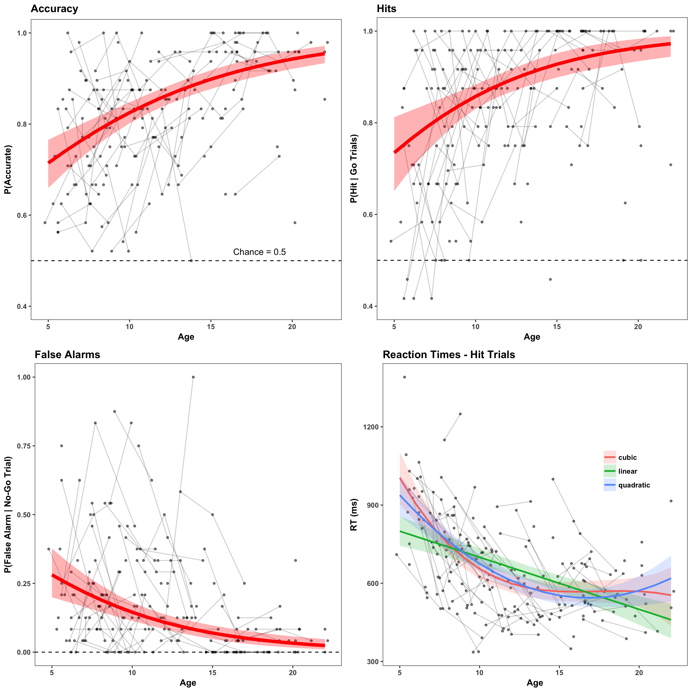

# File setup & task behavior analyses

This subfolder contains scripts for setting up stimulus timing files and running analyses on the task behavior data

## `0_compile_behavioral_data.R`

*Aggregates and cleans up behavioral data files for further use*

1. Loops through the Eprime-generated output for each scan and binds all together into one dataframe for each study timepoint (`wave1`, `wave2`, or `wave3`)
2. Also filters out some participants for whom study log notes indicate technical error (button box not working) or incomplete runs/off task
3. Cleans up group labels (comparison youth versus previously institutionalized youth), and codes correct responses for each trial (buttom press for neutral faces, witholding of press for emotional faces) and categorizes into either `hit`, `false_alarm`, `correct_reject`, or `miss`
4. Combines all waves together and saves to a `.rda` file

## `1_make_stimulus_onsets.Rmd`

*Creates stimulus onset files for each scan in 3-column format for use in FSL Level1 GLM analyses*

1. Faces are onscreen for 350ms. **Note:** Eprime was programmed for this to be 500ms, but because of the 'pre-release functionality', faces wound up being taken off the screen after 350ms. 
2. Loop through all participants and make a stimulus onset file for each run one by calculating the `face.OnsetTime - fix.OnsetTime`. This is is because `fix.OnsetTime` represents the beginning of a fixation cross appearing on the screen right as the BOLD run starts. Stim files are made for fear, happy, and sad runs. 
3. Each full run will have 24 emotional faces and 24 neutral faces. 

See an example 3-column file here for fear faces. The first column is the onset time (in seconds), the second is the face duration (in seconds), and the third is all 1s since we are not using a parametric modulation here (see [the FSL docs](https://fsl.fmrib.ox.ac.uk/fsl/fslwiki/FEAT/UserGuide#EVs) for more info). 

```
31.86 0.35 1
35.777 0.35 1
41.972 0.35 1
52.653 0.35 1
56.571 0.35 1
65.544 0.35 1
84.63 0.35 1
89.116 0.35 1
94.172 0.35 1
99.228 0.35 1
114.396 0.35 1
119.452 0.35 1
139.107 0.35 1
157.69 0.35 1
162.746 0.35 1
171.15 0.35 1
177.345 0.35 1
181.262 0.35 1
200.348 0.35 1
206.542 0.35 1
210.46 0.35 1
231.755 0.35 1
236.242 0.35 1
240.729 0.35 1
```

## `1a_make_afni_stimulus_onsets.Rmd`

*This script is similar to the previous, except that it formats stimuls format files for use with AFNI GLM (`3dDeconvolve`). The AFNI GLMs were used in the multiverse analyses with data preprocessed with C-PAC. Instead of 3 columns, these files are 1 row vector of timings*

Here is the same set of stimulus timings as above, only formatted for AFNI GLM now:

```
31.86 35.777 41.972 52.653 56.571 65.544 84.63 89.116 94.172 99.228 114.396 119.452 139.107 157.69 162.746 171.15 177.345 181.262 200.348 206.542 210.46 231.755 236.242 240.729
```

## `2_model_task_behavior.R`

*This script models age-related changes in task performance for the fear run*

1. First, accuracy is coded as `1` for hits or correct rejects, and `0` for false alarms or misses
2. Then run Bayesian multilevel logistic regresssion models using the [brms](https://github.com/paul-buerkner/brms) package with nested random effects for sessions within participants. Separate models are run for `accuracy`, `hits` (on only neutral face trials), and `false_alarms` (on only fear face trials)
3. Then run similar multilevel regression models that include linear, quadratic, or cubic age terms using brms for the `RT` (reaction time) outcome as a function of age
3. Save brms model objects for further plotting

## `3_plot_task_behavior.Rmd`

*Generate fitted model predictions from the brms models from the previous step for each task performance outcome as a function of age, and plot using `ggplot2`!

1. Generate a 'grid' of age values to generate predictions for (from ages 4-22 years)
2. Extract fitted model predictions from the brms models using the `fitted()` function
3. Plot fitted model predictions overlaid on raw data for each outcome, then use `grid.arrange()` to put them together into a multipanel plot!

