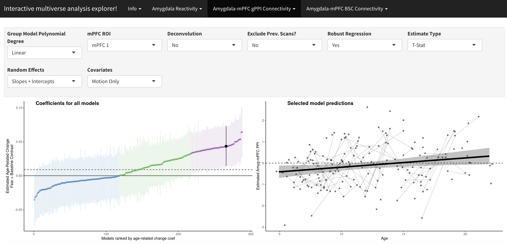
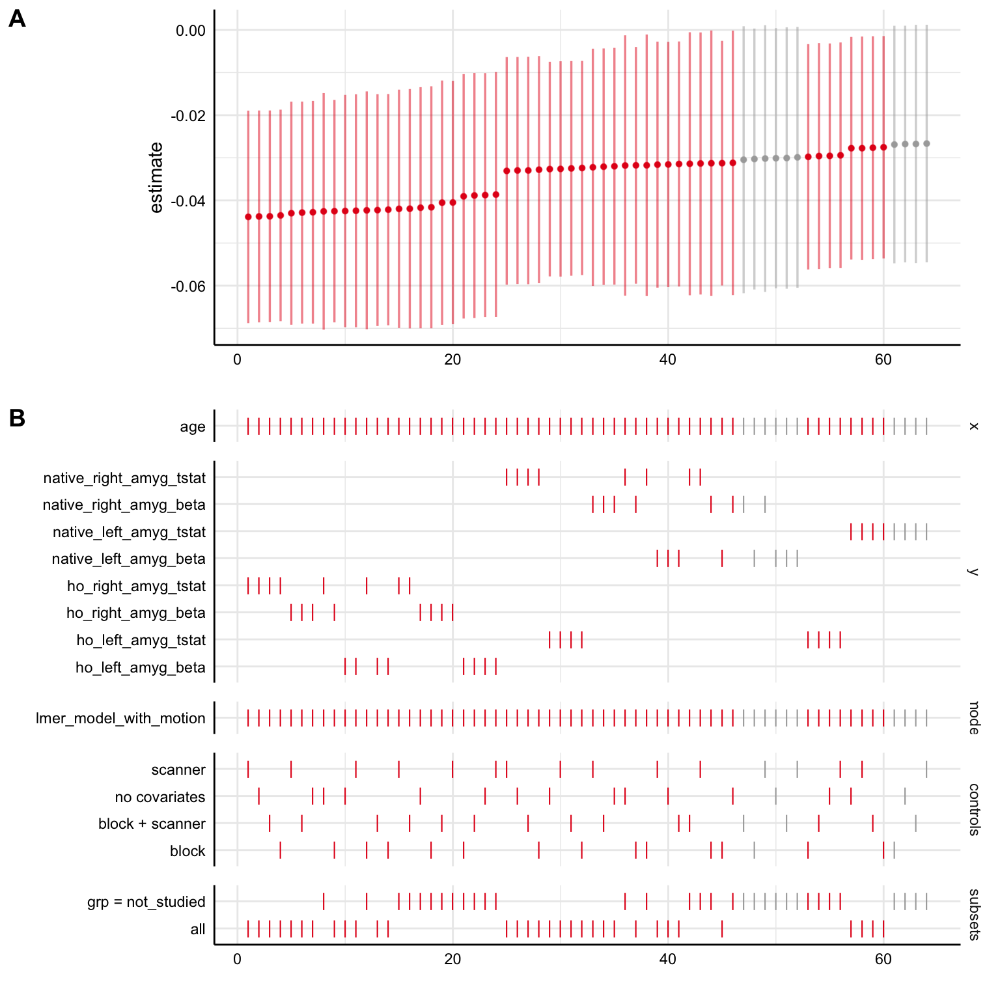

# Preprint Manuscript

All materials here accompany the manuscript for *Age-related change in task-evoked amygdala-prefrontal circuitry: a multiverse approach with an accelerated longitudinal cohort aged 4-22 years*. A preprint of manuscript (not yet peer-reviewed) is posted on [bioRxiv](https://osf.io/).

[{ width=20% }](https://osf.io/)  

# Analysis Code & Documentation

Analysis code (mostly R and Python, with a little Bash) with documentation is posted on Github at [https://github.com/pab2163/amygdala_mpfc_multiverse](https://github.com/pab2163/amygdala_mpfc_multiverse). Unfortunately, because participants did not consent to their data being made public, we cannot publicly post any real data used in the current analyses, so while analysis code is documented on Github, it cannot be run as-is.

[{ width=20% }](https://github.com/pab2163/amygdala_mpfc_multiverse)

# Interactive Multiverse Explorer Tool

Because specification curve analyses make exploring results for individual specifications difficult, we made a web-based [interactive multiverse explorer](https://pbloom.shinyapps.io/amygdala_mpfc_multiverse/). The explorer, built with R and [Shiny](https://shiny.rstudio.com/tutorial/) allows viewers to select analysis options and view age-related change results for specific pipelines for amygdala reactivity and amygdala-mPFC functional connectivity. Try the explorer tool [here](https://pbloom.shinyapps.io/amygdala_mpfc_multiverse/).

[{ width=95% }](https://pbloom.shinyapps.io/amygdala_mpfc_multiverse/)

# Simulated Data

Because we cannot share real data from the current study, we have created and made public simulated dataset sharing a similar structure to the real data for analyses of age-related change in amygdala reactivity. These data can be viewed or downloaded in csv form [here](https://github.com/pab2163/amygdala_mpfc_multiverse/blob/master/docs/simulated_amygdala_reactivity.csv), and documentation for the variables in the dataset can be found in the "Read in the Data" section [here](into_the_bayesian_multiverse.html)

# Multiverse Analysis Code Walkthrough

Using the simulated data describe above, we also put together [documentation](into_the_bayesian_multiverse.html) that: 

1. Provides a walkthough for anyone potentially interested in conducting multiverse analyses (or specification curves) using R, especially when considering Bayesian models or fMRI data. The walkthough highlights the [`specr`](https://cran.r-project.org/web/packages/specr/vignettes/specr.html) package as a particularly useful tool for R users interested in multiverse analyses.
2. Serves as documentation for some of the analysis code for [Bloom et al. 2021](https://osf.io/) with code that can be run using simulated data (i.e. fake data), since we cannot share the data publicly.

[{ width=70% }](into_the_bayesian_multiverse.html)

# Contact info

Questions or comments? Feel free to email paul.bloom@columbia.edu or visit the [Tottenham Lab Website](https://danlab.psychology.columbia.edu/)

[{ width=20% }](https://danlab.psychology.columbia.edu/)
