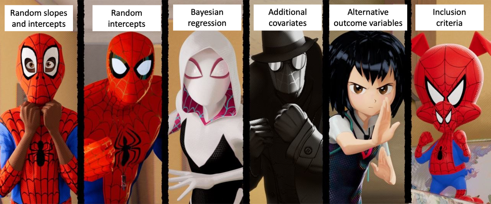
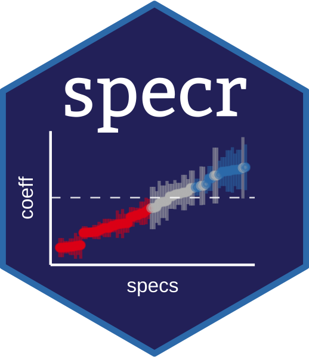

# 0. Background 

Welcome! This document serves 2 purposes:

1. Provide a walkthough for anyone potentially interested in conducting multiverse analyses (or specification curves), especially when considering Bayesian models or fMRI data. 
2. Serve as documentation for analysis code for [Bloom et al., 2021](https://osf.io/) with code that can  be run using *simulated data* (i.e. fake data), since we cannot share the data publicly. Note: the simulated data & corresponding code walkthrough are specifically for amygdala reactivity analyses for the fear > baseline contrast.

Want to try the code out yourself? You can clone the [Github repo](https://github.com/pab2163/amygdala_mpfc_multiverse), or download the [simulated data](https://github.com/pab2163/amygdala_mpfc_multiverse/blob/master/docs/simulated_amygdala_reactivity.csv) and the [into_the_bayesian_multiverse.Rmd](https://github.com/pab2163/amygdala_mpfc_multiverse/blob/master/9_specification_curve_walkthrough/into_the_bayesian_multiverse.Rmd) file to run & experiment with the code.

## What is a multiverse anyway? What is a specification curve? 

A **multiverse analysis** is an analytical tool that helps provide an understanding of whether study results hinge on decisions made during the analysis process. Briefly, a multiverse analysis means that one identifies a set of analyses methods that are all theoretically justified *then conducts all of these analysis "specifications" in parallel*. Then, a **specification curve** can be used for visualization of all of the different analysis specifications at once, as well as statistical inference.

The specification curve analyses here were particularly inspired by work from [Dani Cosme](https://dcosme.github.io/specification-curves/SCA_tutorial_inferential) and [Amy Orben](https://www.amyorben.com/pdf/2019_orbenprzybylski_nhb.pdf).

See more background on the statistics [here](https://www.nature.com/articles/s41562-020-0912-z) 
and [here](https://journals.sagepub.com/doi/10.1177/1745691616658637). 
                              
### A fun way to think about multiverse analyses...

If you've ever seen [Spider Man: Into The Spiderverse](https://www.imdb.com/title/tt4633694/), first of all -- its a great movie. But more specifically, there are many "parallel universes" with different versions of "spider people" in each one. The "spidey-essence" is the same in all universes, but each spider-person (or pig...) is a little different based on the specifics of that universe. So, we can think of the raw data as  the "spidey-essence" in a multiverse analysis, and each model specification is a different "parallel universe" of how the results of the analysis could come out when combined with a certain set of analytical decisions. 

                              
I'm not an expert, but "the multiverse" is now part of the canon of the [Marvel Cinematic Universe](https://marvel.fandom.com/wiki/Multiverse)...


## In what situation should I run a multiverse analysis?

Multiverse analyses are particularly useful when there are [decisions we have to make](http://www.stat.columbia.edu/~gelman/research/unpublished/p_hacking.pdf) during the data preparation and analysis process where we aren't sure what the "right" answer is. If we can think of different methods for cleaning, preprocessing, excluding, transforming, or modeling the data that are theoretically justifiable (but we don't have a certain answer for which is 'best') multiverse analysis allows us to run all of these theoretically justifiable analyses at the same time. This allows us to look at **2 main questions**:

1. Do the results from differing, theoretically justifiable, versions of the analyses converge on a consistent finding?
2. How do different choices we make as analysts of the data influence the results? Which decisions are most influential?

These analyses have been particularly useful with neuroimaging data where there are MANY decisions to be made where we don't have consensus for an "optimal" method. However, multiverse analyses and specification curves equally useful in any topic of research where there are mutiple theoretically justifiable ways an analysis can be done.

## Specification curve analysis steps  

[Simonsohn et al (2020)](https://www.nature.com/articles/s41562-020-0912-z) describe 3 steps for specifiction curve analyses: 

1. define the set of reasonable specifications to estimate
2. estimate all specifications and report the results in a descriptive specification curve
3. conduct joint statistical tests using an inferential specification curve.

Because the analyses presented here are considered exploratory, we aren't going to cover the inferential procedudes in step #3. For more info on this step, including applying bootstrapping & permutation testing to spec curves, see this [great tutorial from Dani Cosme](https://dcosme.github.io/specification-curves/SCA_tutorial_inferential#4_Inferential_statistics).


```{r setup, include=FALSE}
knitr::opts_chunk$set(echo = TRUE) 
```


## Note: simulated data here only!

**Note:** these data are fake! Under our Institutional Review Board protocol and for the purpose of creating participant identies private, we cannot share our actual data publicly. However, we've [*simulated*](https://github.com/pab2163/amygdala_mpfc_multiverse/blob/master/7_group_level_analyses/simulate_amygdala_reactivity/simulate_reactivity_data.Rmd) an amygdala reactivity dataset for the purposes of creating a multiverse analysis where the code can actually be run! You can find the simulated data [here](https://github.com/pab2163/amygdala_mpfc_multiverse/blob/master/docs/simulated_amygdala_reactivity.csv)

* Briefly, to create simulated data that *decently* approximates the real data without risk of identifying participants, we created a multivariate regression model using [brms](https://github.com/paul-buerkner/brms), then drew samples from the model's posterior predictive distribution for fear > baseline amygdala reactivity estimates for each study timepoint for each real participant. 
* We also scrambled the order of participant IDs and added noise to ages. 
* So, the data here should do a *reasonable* job of mimicking the *structure* of some of the data analyzed in [Bloom et al](https://osf.io/) without compromising participant data privacy and security. Some of the relationships among variables may differ somewhat from the real data, however. For more on data synthesis for these purposes, check out the [synthpop](https://cran.r-project.org/web/packages/synthpop/vignettes/synthpop.pdf) R package. 

# 1. Read in the data

```{r message=FALSE, results='hide'}
library(tidyverse)
library(specr)
library(brms)
library(cowplot)
```

Here's what is in each column:

* `id` - participant ID, identifies a participant across timepoints
* `wave` - the study timepoint (either `1`, `2`, or `3`)
* `age` - participant age at the given timepoint, in years
* `block` - the temporal position of the task run relative to other tasks in the scanner (`1` = first, `2` = second, `3` = third)
* `motion` - head motion (mean framewise displacement), which has been z-scored here
* `scanner` - whether the data were collected on a first MRI scanner (`1`= timepoints 1 & 2) or a second (`2` = timepoint 3). Both were Siemens Tim Trio
* `prev_studied`- whether this scan was previously analyzed in similar work by [Gee et al (2013)](https://www.jneurosci.org/content/33/10/4584). `1` indicates a scan was previously studied

All of the rest of the columns are measurements of amygdala reactivity to fear faces > baseline for each scan, labeled such that:

* columns with the `ho` prefix are from amygdala ROIs defined by the Harvard-Oxford subcortical atlas, `native` prefix columns are in native space defined through Freesurfer
* columns with the `right` prefix are the right amygdala, and `left` are the left
* columns with the `beta` prefix denote raw beta estimates of amygdala reactivity magnitude, while the `tstat` prefix denote t-statistic measurements of amygdala reactivity scaled by estimation uncertainty (the standard error)


```{r}
fake_data = readr::read_csv('simulated_amygdala_reactivity.csv')
head(fake_data[,1:8])
```

# 2. Specification curve: `specr` version

[{ width=15% }](https://github.com/masurp/specr)    

[specr](https://cran.r-project.org/web/packages/specr/vignettes/specr.html) is a great package with a lot of nice functionality for running specification curve analyses. This wasn't the software we used for the main analyses (because it hadn't yet been released yet), but it's probably the most straightforward way to go for regression-based specification curve analyses. 

## 2A. Define all 'reasonable' specifictions

First, we'll need to define what  different 'reasonable' and theoretically justifiable ways there are for doing this analysis of age-related change in amygdala reactivity to fear faces > baseline. For the sake of this project, it isn't computationally feasible to try ALL reasonable ways of doing this analysis, so we can think of this approach as attempting to sample from the space of possible analyses specifications. 

* **Covariates:** it might make sense to adjust for factors like `scanner` and `block` in our group-level model, or different subsets of these. 
* **Amygdala ROI:** there are several justifiable ways of defining an 'amygdala' brain region, either using a "native space" mask generated through Freesurfer, or by using Harvard-Oxford amygdala estimates in standard space. We could also us right, left, or bilateral amygdala estimates
* **Estimate type:** Here we pull both from the `beta` images and `tstat` images for 2 different amygdala reactivity estmates. The `beta` is the *contrast parameter estimate* and represents the point estimate (beta estimate) of the regression coefficient. Thus, the the `beta` is the *magnitude* of the estimated relationship between the presence of the task stimuli and the BOLD signal. The `tstat` represents the estimate scaled by the uncertainty (i.e. by the standard error of the estimate), and so it is a *standardized* effect size measure of the relationship between the presence of the task stimuli and the BOLD signal
* **Data inclusion:** Some of the scans studied here were previously analyzed for age-related change in amygdala reactivity by [Gee et al (2013).](https://www.jneurosci.org/content/33/10/4584). So, to get an estimate more independent from the previous work, we might want to exclude these. However, we might have higher statistical power if we include all the available data. 

First, a little data wrangling before modeling. 

* We'll create a variable called `grp` to index whether scans were previously studied for age-related changes in amygdala reactivity in [Gee et al. (2013)](https://www.jneurosci.org/content/33/10/4584). The `not_studied` group here can be considered a more independent sample from the previous study. 
* We'll also create a vector of the outcomes (different measures of amygdala reactivity)

```{r}
fake_data = dplyr::mutate(fake_data, grp = ifelse(is.na(prev_studied), 'not_studied', 'prev_studied'))
outcomes = names(fake_data)[grepl('amyg', names(fake_data))]
```
## 2B. Specify the custom model 

`Specr` has a nice feature of allowing a custom model function. For more detailed info on this, see [here](https://masurp.github.io/specr/articles/random_effects.html).

Here, we set up a multilevel model using the `lme4` package's `lmer()` function to take advangate of varying intercepts for each participant (as denoted by the `(1|id)` syntax in the model formula). We also include a covariate for `motion`, because we want all models to include this covariate for head motion during the scan. We also need to load the `lme4` and `broom.mixed` packages inside the custom model function so that `specr` can use them to run the model and parse the results. 

```{r}
lmer_model_with_motion <- function(formula, data,...) {
  require(lme4)
  require(broom.mixed)
  # set up the model base formula (basically specr will past all other model info in here)
  formula <- paste(formula, "+ motion + (1|id)")
  lme4::lmer(formula, data)
}
```

## 2C. Run all model specifications with `run_specs()`

How does this [`run_specs()`](https://masurp.github.io/specr/reference/run_specs.html) function work?

* `df=fake_data`: specifies the data frame to fit the model to
* `x = 'age'`: the 'x' variable, or predictor of interest in the model. You can have multiple x variables if you want by specificying a vector with multiple values here
* `y = outcomes`: here we specify a vector of multiple outcome variables, the 8 different measures of amygdala reactivity
* `controls = c('block', 'scanner')`: covariates to include in the model. 
* `model = 'lmer_model_with_motion'`: specifies the custom model. If you don't need a custom model, there are also defaults, like `"lm"` to run OLS regression
* `subsets = list(grp = 'not_studied')`: subsets of the data to run the model on, expressed as a list. Here, we want to run the model specifically on the `not_studied` group, in addition to the full dataset. 
* Because we have `all.comb=TRUE`, this will run specifications with all possible combinations of covariates. Otherwise, it will run models with no covariates, each single covariate, and then all together. Note: random slopes are not included for these covariates by default unless we add this to the custom model

Here, 8 outcomes X 4 possible covariate specifications X 2 subsets = 64 total specifications in our multiverse

```{r, message=FALSE, results='hide', warning=FALSE, cache=TRUE}
specs = specr::run_specs(df = fake_data,
                         x = 'age', y = outcomes, 
                         controls = c('block', 'scanner'),
                         model = 'lmer_model_with_motion',
                         subsets = list(grp = 'not_studied'), 
                         all.comb = TRUE)

```

## 2D. Check out results summaries across all models

The output of `run_specs()` is a data frame with each row representing one specification from the multiverse analysis we have just run. The `x`, `y`, `model`, `controls` and `subsets` columns give us information on the setup of each model, then we get a variety of statistical outputs from the fit models. Because we have 64 specifications here, the dataframe is 64 rows. 

* `estimate`: the beta estimate in the regression model for the given `x` term of interest (or the 'slope' for a continuous predictor). Here, these beta estimates represent estimates for age-related change in amygdala reactivity, such that negative estimates indicate age-related decreases in amygdala reactivity.
* `std.error`: The standard error about the beta estimate
* `statistic`: The t-statistic for the beta estimate
* `conf.low`: The lower bound of the 95% confidence interval for the beta estimate
* `conf.high`: The upper bound of the 95% confidence interval for the beta estimate
* all of the `fit_` columns provide information on the goodness-of-fit of the model more generally (i.e. log likelihood, AIC, BIC), as well as the residual degrees of freedom. 

```{r}
specs
```

## 2E. Plot the specification curve

```{r, fig.width=8, fig.height=8}
specr::plot_specs(specs)
```

This type of plot can be overwhelming at first because it shows us a **lot** of information, but it is really helpful for looking at several different things!

* **Panel A** shows us the regression beta estimates for our `x` predictor (plus 95% confidence intervals) for all of our specifications. Specifications are ordered from least to greatest, and colored such that red indicates a significant negative association, gray indicates a nonsignificant association, and blue (not shown on this plot) indicates a significant positive association. So, here, the majority of the specifications indicate a significant negative estimate (under $\alpha=0.05$, such that the 95% confidence interval excludes 0), suggesting a negative relationship here between age and amygdala reactivity. Here, we can see that the *point estimates* of all the models are negative, indicating that all the models agreed on the *direction* of age-related change, if not the significance.
* **Panel B** shows us the details for each specification, keeping the coloring schema from Panel A based on estimate direction/significance. So, looking vertically across the both panels tells us specifics about a single model specification. On any given line, a dash (`|`) indicates that the choice marked on the left was made, where a blank space it wasn't made. 
  * The top section `age` indicates that that the `x` variable (the term being examined) in all models was `age`. 
  * In the `y` section below that, dashes on a given line indicate what `y` variable for amygdala reactivity was used in a given specification (note that different choices for `y` are mutually exclusive). 
  * The `model` section indicates that the `lmer_model_with_motion` was the model used in all specifications here. 
  * The `controls`  section shows which covariates were used in each specification, although we should remember here that ALL models had a covariate for head motion built into them (so `no covariates` really means no covariates *other than head motion*)
  * The bottom section `subsets` indicaates which subset of the data the model was run on, either `all`, or just the `not_studied` group. 
  
* So, what is **Panel B** telling us practically? We can see how estimates term of interest differ as a function of different model specification decision points! In general, if specifications tend to show up towards the left side of the graph, this means that the specifications resulted in *more negative* beta estimates (more negative age-related change in amygdala reactivity here), while specifications that tend to show up towards the right side of the graph tended to result in *more positive* beta estimates. Most specifically, we can see that here in the simulated data:
  * Specifications with `ho_right_amyg_tstat` or `ho_right_amyg_beta` as the `y` variable tended to result in the most strongly negative estimates compared to the others (they show up towards the left side)
  * Specifications with `native_left_amyg_tstat` as the `y` variable tended to result in the most strongly positive estimates compared to the others (they show up towards the right side)

## 2F. View the multiverse decision tree

`specr` also gives us a nice `plot_decisiontree()` function for summarizing what our specifications are, and how many of them there are

```{r}
specr::plot_decisiontree(specs, legend = TRUE)
```

# 3. A bayesian specification curve with `specr` and `brms`

For many analyses, we might want to use Bayesian estimation for models in our specification curve, particularly if we are getting convergence issues or singular fits with `lmer`. In this cases, `lmer` will refuse to let us fit a fully specified longitudinal model with varying terms (slopes) for age for each participant because of the high number of model parameters relative to data points. However, the [brms](https://cran.r-project.org/web/packages/brms/index.html) R package can fit these models with nearly identical syntax to `lmer` using [Stan](https://mc-stan.org/) for fully Bayesian estimation under the hood (note: the high number of parameters relative to the number of observations is *definitely still a problem*, but with Bayesian estimation we can at least fit the model and quantify uncertainty for each parameter).  


While they have many advantages, the main drawback to Bayesian models it that they take longer to fit and require more RAM than do frequentist models. 

* When fitting these yourself, you may want to plan to run 1 model first to get an approximate timing estimate *before* you run a Bayesian specification curve. 
* If available, servers or computing clusters (especially if you can parallelize across specifications) can vastly speed up Bayesian specification curve analyses. 

## 3A. Define a custom `brms` model with participant-varying age terms

The `brm()` function from the [brms](https://cran.r-project.org/web/packages/brms/index.html) package fits models using Bayesian estimation using mostly the same syntax as `lme4` models. Here, we set up a custom model function, making sure to include `(age|id)` to allow age terms to vary for each participant. Also, inside the call to fit the model, we'll add `cores=4` to parallelize running of each model across 4 cores. Most laptops have 4-8 cores, so this should work on most computers, and should speed up each model by a factor of about 4. 

```{r}
brms_model_with_motion <- function(formula, data,...) {
  require(brms)
  require(broom.mixed)
  # set up the model base formula (basically specr will past all other model info in here)
  formula <- paste(formula, "+ motion + (age|id)")
  brms::brm(formula, data, cores = 4)
}
```


## 3B. Run all Bayesian model specifications with `run_specs()`

We'll run the equivalent specifications to the previous curve, only now with `model = 'brms_model_with_motion'` for our custom `brms` model

```{r, message=FALSE, results='hide', warning=FALSE, cache=TRUE}
brms_specs = specr::run_specs(df = fake_data,
                         x = 'age', y = outcomes, 
                         controls = c('block', 'scanner'),
                         model = 'brms_model_with_motion',
                         subsets = list(grp = 'not_studied'), 
                         all.comb = TRUE)
```

## 3C. Check out Bayesian model summaries 

The summary here is quite similar to when we used the `lme4` model, only now the `estimate` is the median estimate for the `x` term (age) across posterior samples, and `conf.low` and `conf.high` represent the bounds of the 95% posterior interval. 

```{r}
brms_specs
```


## 3D. Plot Bayesian specification curve

With the Bayesian models including participant-varying age terms, results are largely similar to before. The main difference is that a slightly larger proportion of the 95% posterior intervals overlap with 0 than with the previous models without participant-varying age terms. 


```{r, fig.width=8, fig.height=8}
specr::plot_specs(brms_specs)
```

## 3E. Plot specification curve with `brms` and `lme4` models together

We can also bind the two output data frames with all the specifications we've already fit together, then plot a curve across all of them to more directly compare the models. Now, in the `models` section of **Panel B** in the plot, we can tell whether the model used for each specification was the `lme4` one (`lmer_model_with_motion`) or the `brms` one (`brms_model_with_motion`)

```{r, fig.width=8, fig.height=8}
# columns are slightly different depending on the model type, so use rbind.fill() to deal with this
all_specs = plyr::rbind.fill(specs, brms_specs)
specr::plot_specs(all_specs)
```

# 4. Bayesian specification curves using custom code

`specr` is a super useful tool, but when we were first running specification curve analyses, the package hadn't been released yet. For the analyses in the manuscript, we used mostly functions from the [tidyverse](https://www.tidyverse.org/), especially the [purrr](https://purrr.tidyverse.org/) package for dealing with nesting data, for estimation of many Bayesian models within multiverse analyses (in fact, `specr` is built using `purrr`). For more background on extreme `tidyverse` usage and `purrr`, check out [this walkthrough from Monica Thieu](https://www.monicathieu.com/posts/2020-04-08-tidy-multilevel/).

While the methods we used required writing more lines of code, one very helpful thing that `specr` doesn't do automatically is do is to *save the fitted model object for each specification*. Storing the fitted model objects will allow us to do a few useful things:

1. Extract [fitted model predictions](https://www.rdocumentation.org/packages/brms/versions/2.9.0/topics/fitted.brmsfit) (i.e. 'predicting the regression line') for each model within a specification curve. In this case, we might want to be able to plot each model's predictions for amygdala reactivity as a function of age. 
2. Make specification curves for different parameters within the models, without having to rerun them all. For example, here we'll look at the regression *intercept term* in a specification curver
3. Evaluate models more generally, including using posterior predictive checks](http://paul-buerkner.github.io/brms/reference/pp_check.brmsfit.html), or getting [cross-validated model performance metrics](https://paul-buerkner.github.io/brms/reference/loo.brmsfit.html) for individual models


## 4A. Convert the data to long format

First, we'll create a grand mean-centered version of our `age` variable called `age_center`. Now, a 0 for `age_center` represents the grand mean age in the dataset, or an age of `r round(mean(fake_data$age), 3)`. We'll use this centered age variable for modeling. 

Then, we use [tidyr::pivot_longer()](https://tidyr.tidyverse.org/reference/pivot_longer.html) to reshape the data into long form, such that all amygdala reactivity estimates are in 1 column called `amygdala_reactivity`, with a variable called `amygdala_measure` indicating which amygdala reactivity measure it is.  

```{r}
fake_data_long = fake_data %>%
  dplyr::mutate(age_center = age - mean(age)) %>%
  tidyr::pivot_longer(contains('amyg'), names_to = 'amygdala_measure', values_to = 'amygdala_reactivity') 

head(fake_data_long)
```
## 4B. Nest the data within each amygdala measure

In this step, we first group the data by `amygdala_measure`, then use [tidyr::nest()](https://tidyr.tidyverse.org/reference/nest.html) to collapse the data within each amygdala measure into a single cell containing a [tibble object](https://tibble.tidyverse.org/)(basically a fancy dataframe). Now, our dataset has only 8 rows, with the `data` column containing an entire dataset for each amygdala measure in each cell. We also add an `index` variable to keep track of the data shape here. 

```{r}
fake_data_nested = fake_data_long %>%
  dplyr::group_by(amygdala_measure) %>%
  tidyr::nest() %>%
  dplyr::ungroup() %>%
  dplyr::mutate(., index = 1:nrow(.))

fake_data_nested
```
## 4C. Run all model specifications!

To keep things a little more concise for the sake of this walkthrough, we'll pare down to a total of 16 specifications for this analysis: 8 amygdala measures (right vs. left, native space vs. Harvard-Oxford, beta vs. tstat) X 2 model types (with participant-varying slopes + intercepts vs. only participant-varying intercepts)

Now, we'll use the `purrr:map()` function inside `dplyr::mutate()`. This is a lot at once, but it allows us to make new columns with `brms` model objects stored in each cell. We use `data` as the first argument to the `purrr:map()` function to tell `brms::brm()` to fid the model to the *nested dataset* stored in each cell of the `data  column. 

Since we are making 2 new columns with `dplyr::mutate()`, one for each of the two model formulations (`model_varying_slopes`, and `model_varying_intercepts`), we'll use `tidyr::pivot_longer()` again to put all models objects into one `model_object` column, with the `model_type` column now indicating whether there are varying slopes or just intercepts. **Note:** this step takes about 15 min (on a 2019 Macbook Pro) because we are running 16 Bayesian models in a row!

```{r, message=FALSE, results='hide', warning=FALSE, cache=TRUE}
nested_model_frame = fake_data_nested %>%
    dplyr::group_by(amygdala_measure) %>%
    dplyr::mutate(., model_varying_slopes = purrr::map(data, ~brms::brm(amygdala_reactivity ~ age_center + motion + (age|id), 
                                                  data = ., cores = 4, chains = 4)),
                    model_varying_intercepts = purrr::map(data, ~brms::brm(amygdala_reactivity ~ age_center + motion + (1|id), 
                                                  data = ., cores = 4, chains = 4))) %>%
    tidyr::pivot_longer(contains('model'), names_to = 'model_type', values_to = 'model_object')
```


## 4D. Pull coefficients for each model using `broom.mixed::tidy()`

Now that we've run lots of models, we can use `broom.mixed::tidy()` to pull out all the coefficients for each one. This function is just like the [broom::tidy()](https://cran.r-project.org/web/packages/broom/vignettes/broom.html) function, except that it allows us to work with multilevel models (`lme4`, `brms`, or `rstanarm`, for example).

So, well make a new dataframe called `purrr_specs` where we pull the coefficients for each model (again using `purrr::map()` for storing the output in individual cells). Finally, we'll use [tidyr::unnest()](https://tidyr.tidyverse.org/reference/nest.html) to 'flatten' the coefficient output for each model back into regular dataframe colums. In other words, we're taking all of the coefficient information, and making 1 column for each piece of information.  

```{r, cache=TRUE}
purrr_specs = nested_model_frame %>%
  mutate(., coefs = purrr::map(model_object, ~broom.mixed::tidy(.))) %>%
  dplyr::select(., -data, -model_object) %>%
  tidyr::unnest(coefs)
```

The output looks very similar to what we previously were working with from `specr` EXCEPT that we have multiple rows for each specification here. In fact, we have 1 row for each of the coefficients in each model pulled by `broom.mixed::tidy()` (we are pulling the `Intercept`, `age_center`, `motion` fixed effects terms from the model, parameter estimates for some of the variances/covariances of the participant-varying terms). 

```{r}
purrr_specs
```

If we want to make this look almost like the `specr` output, we can filter for the model term we're looking for. In this case, `age_center` is the parameter of primary interest for looking at age-related change in amygdala reactivity for the fear > baseline contrast.

```{r}
purrr_specs_age = dplyr::filter(purrr_specs, term == 'age_center')
purrr_specs_age
```

## 4E. Custom SCA Plot Function

Now, we want to make our descriptive specification curve plot! We've created a function for this study  that is *very heavily inspired* by [Dani Cosme's spec curve R code](https://dcosme.github.io/specification-curves/SCA_tutorial_inferential#3_Plot_specification_curve).

It's a chunky function with a lot of code, but overall what it does is this:

* Make `sca_decision_frame`, a dataframe with 1 column for each design point coded as a binary decision, such that there is a `|` to indicate a 'yes' and `NA` to indicate a 'no' (this is important for the bottem panel). This dataframe also creates a `rank` variable to rank specifications by their point estimates, and an `overlap_0` variable to indicate the sign of the point estimate, plus whether the 95% posterior interval overlaps 0
* Convert `sca_decision_frame` to long format, then group decision points into categories for visualization
* For the top panel, plot `sca_decision_frame` using [ggplot2](https://ggplot2.tidyverse.org/) with the `rank` for each specification on the x-axis and each specification's point estimate + 95% posterior interval on the y axis. We also color each specification according to the sign of the point estimate and whether the 95% posterior interval overlaps 0. Also, add a horizontal dashed line and an additional point/error bar in black to indicate the median estimate across specifications. 
* For the bottom panel, plot `sca_decision_frame_long` using [ggplot2](https://ggplot2.tidyverse.org/) as well, withspecification `rank` again on the x-axis. This time, the y axis is categorical, with each level representing a different decision point. Then, we use `geom_text(label=choice)`, where `choice` is the variable coded as either `|` or `NA` for each binarized decision point. This will give us a little vertical tick on the plot for each row every time the `choice` was 'yes', and a blank space every time the `choice` was 'no'. So, we'll get 1 row each on the y-axis for each binarized choice, then vertical ticks marking if that choice was made or not. For each choice, we'll also plot a black point + horizontal interval representing the median `rank` and 25%-75% quantiles of the `rank` when the `choice` was 'yes'. 
* Lastly, we use [cowplot::plot_grid()](https://wilkelab.org/cowplot/articles/plot_grid.html) to vertically align the two panels and label them. Then, we return the data frames & plot objects in a named list. 

**Note:** this is a slightly shortened version of the function intended specifically for amygdala reactivity analyses in the current study. It will have to be somewhat modified to work more generally in other contexts. 
```{r, class.source = 'fold-hide'}
make_sca_plot = function(specs, fork_list, plot_title, y_label, term_choice){
  # compile sca decision frame
  sca_decision_frame = specs %>%
    ungroup %>% 
    dplyr::filter(term == term_choice) %>%
    dplyr::arrange(estimate) %>%
    mutate(., rank = 1:nrow(.),
           tstat = ifelse(grepl('tstat', amygdala_measure), '|', NA),
           random_slopes = ifelse(grepl('intercepts', model_type), '|', NA),
           amyg_right = ifelse(grepl('right', tolower(amygdala_measure)), '|', NA),
           amyg_left = ifelse(grepl('left', tolower(amygdala_measure)), '|', NA),
           native_space = ifelse(grepl('native', amygdala_measure), '|', NA),
           overlap_0 = case_when(
             conf.low < 0 & conf.high < 0 ~ 'neg_y',
             conf.low < 0 & estimate < 0 & conf.high > 0 ~ 'neg_n',
             conf.low < 0 & estimate > 0 & conf.high > 0 ~ 'pos_n',
             conf.low  > 0 & conf.high > 0 ~ 'pos_y',
           ))

  # median model
  median_model_frame = sca_decision_frame %>%
    summarise(estimate = median(estimate), 
              conf.low = median(conf.low), conf.high = median(conf.high), 
              rank= median(rank))
  
  # order factor levels for overlap_0 variable
  sca_decision_frame$overlap_0 = factor(sca_decision_frame$overlap_0, 
                                        levels = c("neg_y", "neg_n", "pos_n", "pos_y"))
  
  # convert to long, assign decition types
  sca_decision_frame_long = sca_decision_frame %>%
    tidyr::pivot_longer(names_to = 'fork', values_to = 'choice', all_of(fork_list)) %>%
    mutate(decisiontype = case_when(
      grepl('amyg', fork) ~ 'Amygdala\n Roi',
      fork == 'native_space' ~ 'Amygdala\n Roi',
      fork %in% c('random_slopes', 'model_type') ~ 'Group-Level\nModel',
      fork %in% c('tstat') ~ 'Subject-Level\nModel'
    ))
  
  # get average rank of each amygdala_measure by beta estimate
  sca_decision_frame_long_ranks = sca_decision_frame_long %>%
    dplyr::filter(choice == '|') %>%
    dplyr::group_by(fork) %>%
    summarise(mean_rank = -1*mean(rank))
  
  # join ranks with decision frame
  sca_decision_frame_long = left_join(sca_decision_frame_long, sca_decision_frame_long_ranks)
  
  # rename variables to be human-interpretable
  sca_decision_frame_long$fork = 
    dplyr::recode(sca_decision_frame_long$fork, 
                  'tstat' = 'use tstats (vs. beta estimates)',
                  'native_space' = 'native space (vs. mni space)',
                  'model_type' = 'random intercepts only (vs. random slopes)',
                  'amyg_right' = 'right amygdala',
                  'amyg_left' =  'left amygdala')
  
  # reorder forks by mean rank
  sca_decision_frame_long$fork_ordered = reorder(sca_decision_frame_long$fork,  
                                                 sca_decision_frame_long$mean_rank)
  
  # color palette to code the following:
  # blue = negative, distinct from 0
  # red = negative, not distinct from 0
  # green = positive, not distinct from 0
  # purple = positive, distinct from 0
  if('neg_y' %in% sca_decision_frame$overlap_0){
    my_colors <- RColorBrewer::brewer.pal(4, "Set1")[1:4]
  }else if('neg_n' %in% sca_decision_frame$overlap_0){
    my_colors <- RColorBrewer::brewer.pal(4, "Set1")[2:4]
  }else if('pos_n' %in% sca_decision_frame$overlap_0){
    my_colors <- RColorBrewer::brewer.pal(4, "Set1")[3:4]
  }else{
    my_colors <- RColorBrewer::brewer.pal(4, "Set1")[4:4]
  }
  
  # recode overlap 0 markings for informative legend
  sca_decision_frame$overlap_0 = dplyr::recode(sca_decision_frame$overlap_0,
                                               'neg_y' = '-, 95% PI excluding 0',
                                               'neg_n' = '-, 95% PI including 0',
                                               'pos_n' = '+, 95% PI including 0',
                                               'pos_y' = '+, 95% PI excluding 0')
  
  
  # summary for lower plot (median + IQR)
  decision_summary = sca_decision_frame_long %>% 
    group_by(decisiontype, choice, fork, fork_ordered) %>%
    summarise(n = n(), median_rank = median(rank), 
              lwr_rank = quantile(rank, .25), 
              upr_rank = quantile(rank, .75)) %>%
    dplyr::filter(choice =='|')
  
  # top panel
  sca_top = 
    ggplot(sca_decision_frame, aes(x = rank, y = estimate, color = overlap_0)) +
    geom_hline(yintercept = 0, lty = 1, color = 'black') +
    geom_hline(yintercept = median(sca_decision_frame$estimate), color = 'black', lty = 2) +
    geom_point(alpha = .5) + 
    geom_errorbar(aes(ymin = conf.low, ymax = conf.high), width = 0, lwd = .15, alpha = .5) +
    geom_point(data = median_model_frame,aes(x = rank, y = estimate), 
               color = 'black') +
    geom_errorbar(data = median_model_frame, 
                  aes(x = rank, y = estimate, ymin = conf.low, ymax = conf.high), 
                  color = 'black', width = 0) +
    labs(x = '', y = y_label, title = plot_title) +
    theme_classic() +
    theme(legend.position = 'top', legend.title = element_blank()) +
    scale_color_manual(values = my_colors)
  
  # lower panel
  sca_bottom = 
    ggplot(sca_decision_frame_long, aes(x = rank, y = fork_ordered, color = overlap_0)) +
    geom_text(aes(label = choice), alpha = .4) +
    facet_grid(rows = vars(decisiontype), drop = TRUE, 
               scales = 'free_y', space = 'free_y') +
    geom_point(data = decision_summary, aes(x = median_rank, y = fork_ordered), 
               color = 'black') +
    geom_errorbarh(data = decision_summary, 
                   aes(x = median_rank, y = fork_ordered, xmin = lwr_rank, xmax = upr_rank), 
                   color = 'black', width = 0) +
    labs(x = "Analysis specifications ranked by beta estimates", y = "Decision Points") + 
    theme_bw() + 
    theme(legend.title = element_text(size = 10),
          legend.text = element_text(size = 8),
          axis.text = element_text(color = "black", size = 8),
          legend.position = "none",
          panel.grid.major = element_blank(),
          panel.grid.minor = element_blank(),
          panel.background = element_blank(),
          strip.text.y = element_text(size = 8)) +
    scale_color_manual(values = my_colors) 
    
  
  # put together using cowplot
  sca_panel = cowplot::plot_grid(sca_top, sca_bottom, ncol = 1, align = "v", axis = 'lr', 
                                 labels = c('A', 'B'))
  
  # return a list including formatted data, as well as plots
  return(list('sca_decision_frame' = sca_decision_frame, 
              'sca_decision_frame_long' = sca_decision_frame_long,
              'sca_top' = sca_top,
              'sca_bottom' = sca_bottom,
              'sca_panel' = sca_panel))
}
```

## 4F. Plot custom `brms` spec curve

First, we run `make_sca_plot()` to generate the plot object

```{r,message=FALSE, results='hide', warning=FALSE}
age_center_spec_curve = make_sca_plot(specs = purrr_specs, 
                  fork_list = c('tstat', 'random_slopes', 'amyg_right', 'amyg_left', 'native_space'), 
                  y_label = 'Age-related change in amyg reactivity\nFear > Neutral Faces', 
                  term_choice = 'age_center', 
                  plot_title = 'Custom plot for simulated data spec curve')

```

Then display the `sca_panel`. Although this is a slightly different set of specifications to the previous curves, we can see that the results are pretty similar -- most specifications show negative age-related change estimates. 

```{r, fig.width=8, fig.height=8}
age_center_spec_curve$sca_panel
```


## 4G. A spec curve for the model intercept

Here, we can also plot a specification curve for the regression *intercept* term. In this case, the intercept represents the average estimated amygdala reactivity to fear faces > baseline for a participant of `age_center=0` (age ~12.3 years) and `motion=0` (average head motion amounts). We can do this by setting `term_choice = '(Intercept)'` and re-running `make_sca_plot()`

```{r, message=FALSE, results='hide', warning=FALSE}
intercept_spec = make_sca_plot(specs = purrr_specs, 
                    fork_list = c('tstat', 'random_slopes', 'amyg_right', 'amyg_left', 'native_space'), 
                    y_label = 'Estimated Amygdala Reactivity at Age 12.3\nFear > Neutral Faces', 
                    term_choice = '(Intercept)', 
                    plot_title = 'Custom plot for the spec curve for the model *intercepts*')
```

This plot shows that all specificationss estimate positive average amygdala reactivity a participant at age 12.3 and mean head motion levels, with 95% posterior intervals excluding 0. 

```{r, fig.width=8, fig.height=8}
intercept_spec$sca_panel
```

# 5. Get fitted model predictions from the custom `brms` multiverse

Because we've saved the fitted model objects into a nested data frame for each specification in our custom multiverse, we can also *extract fitted predictions* for each model. Here, we'll do this to visualize each model's predictions for averaae amygdala reactivity (for fear faces > baselines) as a function of age. 


First, we'll define a grid of predictor values for which to make predictions. Here, we'll set `motion=0` (average head motion across the dataset), and `age_center=-8:10` to be able to generate a prediction for a range of ages
```{r}
pred_grid = expand.grid(age_center = -8:10, motion = 0) %>%
  dplyr::mutate(age = age_center + mean(fake_data$age))

head(pred_grid)
```

Now, we can use `purrr::map()` again with [stats::fitted()](https://www.rdocumentation.org/packages/stats/versions/3.6.2/topics/fitted) to generate fitted values (estimates of the [linear predictor](https://mc-stan.org/rstanarm/reference/posterior_linpred.stanreg.html)) for each specification. 

* We'll use the arguments `newdata = pred_grid` to specificy which values of the predictors to generate predictions for, and `re_formula = NA` to indicate not to worry about participant-varying random effects here
* Just like when we pulled the model coefficients with `broom.mixed::tidy()`, the predictions for each specification are nested into cells of the `model_preds` column. We use `tidyr::unnest(model_preds)` to flatten them back out and get a data frame (in long form) of predictions for each model


```{r, message=FALSE, results='hide', warning=FALSE, cache=TRUE}
purrr_specs_preds = nested_model_frame %>%
  dplyr::mutate(model_preds = purrr::map(model_object, ~stats::fitted(., newdata = pred_grid, re_formula = NA) %>%
               cbind(pred_grid, .))) %>%
  dplyr::select(-data, -model_object) %>%
  tidyr::unnest(model_preds)
```

For each specification, and for each level of `age_center`, we get an `Estimate` (the median posterior estimate), as well as the upper/lower bounds of the 95% posterior interval. 

```{r}
head(purrr_specs_preds)
```


## Spaghetti plot of model predictions across specifications

Now that we've extracted the fitted predictions for each model, we can plot the group-average 'regression line' for each one. 

* Here we'll color the specifications by whether they included particiapnt-varying slopes, or just intercepts. 
* Here, each line represents the model predictions for 1 specification. 
* This can be a good way to summarize fitted model predictions across a multiverse, even if we can't see the uncertainty about the regression line for any given specification. 

```{r}
ggplot(data = purrr_specs_preds, aes(x = age, y = Estimate, 
                                     group = interaction(amygdala_measure, model_type), 
                                     color = model_type)) +
  geom_hline(yintercept = 0, lty = 2) +
  geom_line() +
  theme_bw() +
  labs(y = 'Estimated Amygdala Reactivity\nFear > Baseline')
```


## Panel plot of fitted predictions

We can also plot each specification here as a separate panel, and include the 95% posterior interval for the fitted model predictions at each level of `age`. This is just about possible with 16 specifications, but many more than that and we probably won't have room on the screen to view them all. 

```{r, fig.width=9}
ggplot(data = purrr_specs_preds, aes(x = age, y = Estimate)) +
  geom_hline(yintercept = 0, lty = 2) +
  geom_line() +
  geom_ribbon(aes(ymin = `Q2.5`, ymax = `Q97.5`), alpha = .3) + 
  theme_bw() +
  labs(y = 'Estimated Amygdala Reactivity\nFear > Baseline', 
       title = 'Panel plot with fitted model predictions for each specification') +
  facet_grid(rows = vars(model_type), cols = vars(amygdala_measure)) +
  theme(strip.text = element_text(size = 6))
```

## Plot an individual model's fitted predictions with raw data

As a check of a model's fit, it is often helpful to look at the fitted predictions overplotted on top of the raw datapoints. We can do that by filtering our predictions to just look at one single specification (`amygdala_measure == 'ho_right_amyg_beta'`, `model_type == 'model_varying_slopes'`), then plotting with `ggplot()` with age on the x-axis and estimated amygdala-reactivity on the y-axis, along with the raw data used by that specification. 

```{r}
one_spec_preds = dplyr::filter(purrr_specs_preds, amygdala_measure == 'ho_right_amyg_beta', model_type == 'model_varying_slopes')

ggplot(fake_data, aes(x = age, y = ho_right_amyg_beta)) +
  geom_hline(yintercept = 0, lty = 2) +
  geom_point() + 
  geom_line(aes(group = id), alpha = .1) +
  geom_line(data = one_spec_preds, aes(x = age, y = Estimate)) +
  geom_ribbon(data = one_spec_preds, aes(x = age, y = Estimate, ymin = `Q2.5`, ymax = `Q97.5`), alpha = .3) +
  theme_bw() +
  labs(y = 'Estimated Amygdala Reactivity\nFear > Baseline', 
       title = 'Model predictions & raw data for one specification', 
       subtitle = 'Harvard-Oxford right amygdala betas, brms model with varying slopes')

```

This is a nice check of our model fits! However, the more specifications we have, the more difficult it is to look at so many plots for individual specifications like this. To that end, for this study we have made [an interactive multiverse explorer Shiny app](https://pbloom.shinyapps.io/amygdala_mpfc_multiverse/) for browsing model fits across specifications. 


# 6. Multiverse model checks

## 6A. Graphical posterior predictive checks

In addition to looking at the coefficients and predicitons from our different specifications, we may also want to perform [posterior predictive checks](https://cran.r-project.org/web/packages/LaplacesDemon/vignettes/BayesianInference.pdf) for each one. 

What is a posterior predictive check?
* We draw a "simulated dataset" from the model's posterior distribution, then compare the overall distribution to the real observed data (see [Gabry et al., 2019](https://arxiv.org/abs/1709.01449)). 
* Basically, a posterior predictive check is helpful in answering the question "is the model giving us a distribution of predictions that matches the real data". If the distributions match, this doesn't mean the model is *good* per se (the individual predictions could still be very bad), but if the distributions *don't match*, then we know that the model is definitely not doing a good job at describing the data generation process. 

To get these graphical summaries of the posterior predictive check, we use the [pp_check()](http://paul-buerkner.github.io/brms/reference/pp_check.brmsfit.html) function for `brms` models (I know...). Here, we'll first combine this with `purrr_map()` to draw 10 samples from the posterior predictive distribution for all observations in the real dataset. 

```{r, cache=TRUE}
pp_check_grid = nested_model_frame %>%
  dplyr::mutate(chex = purrr::map(model_object, ~brms::pp_check(., nsamples = 10)))

# Make a new column to label all specifications
nested_model_frame = mutate(nested_model_frame,
                            spec = paste0(amygdala_measure, ', ', model_type))

```

Now, we can use `cowplot::plot_grid()` again to make a panel of all 16 graphical posterior predictive checks, one for each model in our specification curve. We can use the `labels` argument to label each plot for each specification. Here, $y$ represents the distribution of actual observations, and each $y_{rep}$ distribution is one set of the posterior draws. 

```{r, cache=TRUE}
cowplot::plot_grid(plotlist = pp_check_grid$chex, 
                   labels = as.vector(nested_model_frame$spec), 
                   label_size = 4, label_x = 0, hjust = 0)
```


Again, this is a more descriptive analysis -- it allows us to visually compare which specifications result in a model posterior distribution that most closely matches the observed data. 


## 6B. Approximate leave-one-out (LOO) cross-validation

We might often want to to get a specification curve for the relative model 'goodness-of-fit', or an approximate of predictive performance, for all specifications. We can use [brms::loo()](https://www.rdocumentation.org/packages/brms/versions/2.15.0/topics/loo.brmsfit) to performe approximate leave-one-out (LOO) cross-validation for each model. So, here, well use `purrr::map()` again with `brms:loo()` to get these estimates

* This function will give us a cross-validated estimate for the expected log pointwise predictive density, or [ELPD](https://avehtari.github.io/modelselection/CV-FAQ.html), as a metric for the "expected predictive performance" for a model. ELPD as estimated by LOO cross-validation is similar in purpose to the Akaike Information Criterion (AIC), although it takes model priors into account and does not make distributional assumptions about the posterior (see [Vehtari, Gelman, & Gabry, 2017](https://link.springer.com/article/10.1007/s11222-016-9696-4))
* This function uses Pareto smoothed importance sampling ([Vehtari et al., 2015](https://arxiv.org/abs/1507.02646)) for cross-validation here, which means that unless results are very bad, we won't have to repeatedly refit the Bayesian models (which would take a while)

```{r, message=FALSE, results='hide', warning=FALSE, cache=TRUE}
loo_cv_grid = nested_model_frame %>%
  dplyr::mutate(loo_cv = purrr::map(model_object, ~brms::loo(.)$estimates))
```


Now, we can unnest our ELPD estimates as well as their standard errors, then plot them for each specification. 
```{r}
# unnest and wrangle elpd estimates into the data frame 
loo_unnest = unnest(loo_cv_grid, loo_cv)
loo_cv_grid$elpd_loo = as.numeric(loo_unnest$loo_cv[,1][row.names(loo_unnest$loo_cv)=='elpd_loo'])
loo_cv_grid$elpd_loo_se = as.numeric(loo_unnest$loo_cv[,2][row.names(loo_unnest$loo_cv)=='elpd_loo'])
```

The raw value of ELPD by itself doesn't mean much intrinsically, but since higher (or less negative) ELPD is better, we can use this to compare expected model predictive performance. So, we can see here that model predictive performance is mostly impacted here by the amygdala measure used, although for most measures, the models with varying intercepts have slightly higher (better) ELPD than models with varying slopes. 


```{r}
ggplot(loo_cv_grid, aes(x = fct_reorder(spec, elpd_loo), y = elpd_loo)) +
  geom_point() +
  geom_errorbar(aes(ymin = elpd_loo - elpd_loo_se, ymax = elpd_loo + elpd_loo_se)) +
  coord_flip() +
  theme_bw() +
  labs(x = 'Specification', y = 'elpd_loo')
```

# 7. Recap

Though we can't share the real data used in the current study, hopefully these walkthroughs of multiverse analyses using publicly available [simulated data](https://github.com/pab2163/amygdala_mpfc_multiverse/blob/master/docs/simulated_amygdala_reactivity.csv) have been helpful! Overall, we find that specification curves can a super useful as a way to examine the robustness of results when we're faced with many analysis decision points. For anyone who is interested, good luck *traveling the multiverse!*

**Questions?** Feel free to reach out to paul.bloom@columbia.edu

# Resources

## Readings on specification curves & multiverse analyses

* [Del Guidice & Gangestad, 2021](https://journals.sagepub.com/doi/10.1177/2515245920954925)
* Simonsohn, Simmons, & Nelson [2015](https://sticerd.lse.ac.uk/seminarpapers/psyc16022016.pdf) & [2020](https://www.nature.com/articles/s41562-020-0912-z)
* [Steegen et al., 2016](https://journals.sagepub.com/doi/10.1177/1745691616658637)

## A few papers using multiverse analyses

* [Cosme & Lopez, 2021](https://psyarxiv.com/23mu5/)
* [Orben & Przybylski, 2019](https://www.nature.com/articles/s41562-018-0506-1)
* [Frey et al., 2021](https://psycnet.apa.org/record/2020-15046-001)
* [Wessel et al., 2020](https://www.tandfonline.com/doi/full/10.1080/09658211.2020.1797095)

## Resources for conducting specification curve analyses with R

* The [specr](https://github.com/masurp/specr) R package for making specification curves
* [Dani Cosme's comprehensive SCA tutorial](https://dcosme.github.io/specification-curves/SCA_tutorial_inferential)
* [Monica Thieu's tutorial](https://www.monicathieu.com/posts/2020-04-08-tidy-multilevel/) on wrangling mulilevel data using the tidyverse, especially with `purrr`
* [Columbia Psychology Scientific Computing R tutorials, videos, & challenges](https://cu-psych-computing.github.io/cu-psych-comp-tutorial/) (good for getting started with R)

## R session info

```{r}
sessionInfo()
```